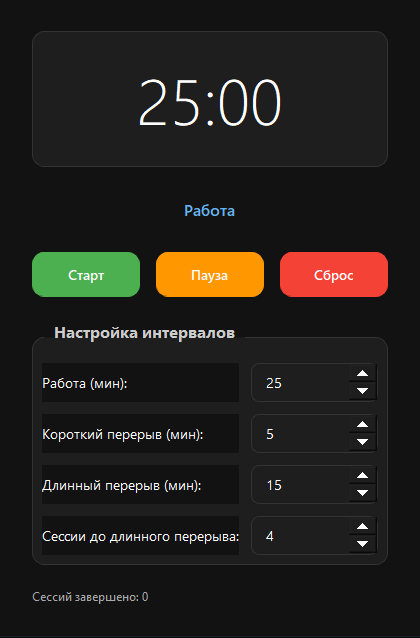

# Pomodoro Timer

A modern, minimalist Pomodoro timer application built with Python and PyQt5. Features a dark theme, system tray integration, and persistent settings.

## Features

- **Pomodoro Technique**: 25-minute work sessions with 5-minute short breaks and 15-minute long breaks
- **Dark Minimalist UI**: Clean, modern interface with rounded buttons and smooth animations
- **System Tray**: Minimize to tray and continue working in the background
- **Persistent Settings**: Save your preferences and session data
- **Logging**: Comprehensive logging for debugging and monitoring
- **Customizable**: Adjust work/break times and session counts

## Screenshots



## Installation

### Prerequisites

- Python 3.6+
- PyQt5

### Install Dependencies

```bash
pip install PyQt5
```

### Run the Application

```bash
python main.py
```

## Usage

1. **Start Timer**: Click the "Старт" (Start) button to begin a work session
2. **Pause/Resume**: Use the "Пауза" (Pause) button to pause the timer
3. **Reset**: Click "Сброс" (Reset) to restart the current session
4. **Settings**: Adjust work time, break durations, and session counts in the settings panel
5. **System Tray**: Minimize the app to continue in the background

## Project Structure

```
pomodoro-timer/
├── main.py                 # Application entry point
├── controllers/
│   └── controller.py       # MVC Controller
├── models/
│   ├── timer_logic.py      # Timer logic and state management
│   └── data_manager.py     # Data persistence (JSON)
├── views/
│   ├── ui.py               # Main UI components
│   └── tray_icon.py        # System tray functionality
├── utils/
│   ├── constants.py        # Application constants and styles
│   └── logger.py           # Logging configuration
├── data/                   # Persistent data storage
├── logs/                   # Application logs
├── .gitignore
├── README.md
└── requirements.txt
```

## Architecture

The application follows the Model-View-Controller (MVC) pattern:

- **Model**: Handles data and business logic (`models/`)
- **View**: Manages UI components (`views/`)
- **Controller**: Coordinates between model and view (`controllers/`)

## Configuration

Settings are stored in `data/settings.json`:

```json
{
  "work_time": 25,
  "short_break": 5,
  "long_break": 15,
  "sessions_before_long": 4
}
```

Session data is saved in `data/sessions.json`.

## Logging

Logs are written to `logs/app.log` with the following levels:
- INFO: General application events
- ERROR: Error conditions

## Contributing

1. Fork the repository
2. Create a feature branch (`git checkout -b feature/amazing-feature`)
3. Commit your changes (`git commit -m 'Add some amazing feature'`)
4. Push to the branch (`git push origin feature/amazing-feature`)
5. Open a Pull Request

## License

This project is licensed under the MIT License - see the [LICENSE](LICENSE) file for details.

## Acknowledgments

- Pomodoro Technique by Francesco Cirillo
- PyQt5 for the GUI framework
- Material Design for UI inspiration
